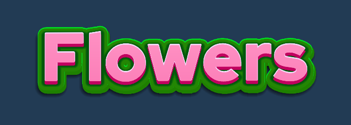

# StackedText

**Stylized layered text effects for TextMeshPro in Unity**

StackedText is a lightweight Unity component that generates stacked, multi-layered text with customizable colors, offsets, softness, and dilation — all driven by a single `TMP_Text` component. Perfect for game titles, UI headers, and stylized labels.

---

<p align="center">
  
</p>

## Examples

<p align="center">
  
  
</p>
<p align="center">
  
</p>

---

## Features

- **Single Drawcall** — Embeds the parameters into texcoord3 channel to achieve single drawcall.
- **Multiple Stack Layers** — Add as many stacks as you need, each with independent settings.
- **Per-Layer Gradient Colors** — Assign a `Gradient` to each stack for smooth color transitions across layers.
- **Configurable Offsets** — Set start and end offsets per stack to control the direction and depth of the effect.
- **Softness & Dilation** — Fine-tune the edge softness and thickness of each layer independently.
- **Curve Support** — Apply an `AnimationCurve` to bend text along an arc, with optional centering and reference width.
- **Editor Preview** — Runs in Edit Mode via `[ExecuteInEditMode]`, so you see results instantly without entering Play Mode.
- **Zero Allocation at Runtime** — Reuses cached lists and meshes to avoid GC pressure during updates.
- **Automatic Material Setup** — Detects and creates a compatible `Distance Field Dilate` material if one isn't assigned.

---

## Requirements

| Dependency | Version |
|---|---|
| Unity | 2021.3+ |
| TextMeshPro | Built-in (via Package Manager) |

---

## Installation

### Option A — Copy the Script

1. Download or clone this repository.
2. Copy `StackedText.cs` into your project's `Assets/` folder (or any subfolder).

### Option B — Unity Package Manager (Git URL)

1. Open **Window → Package Manager**.
2. Click **+** → **Add package from git URL…**
3. Paste:
   ```
   https://github.com/<your-username>/StackedText.git
   ```

---

## Quick Start

1. Add a **TextMeshPro** text object to your scene (UI or World Space).
2. Add the **StackedText** component to the same GameObject.
3. The `Text` field auto-populates. If not, drag your `TMP_Text` reference in.
4. Click **+** on the **Stacks** list to add a layer.
5. Configure the stack's **Color**, **Start/End Offset**, **Softness**, and **Dilate** to taste.
6. Enable **Use Curve** and adjust the **Curve** and **Curve Scale** for arced text.

---

## Stack Configuration

Each `StackConfig` entry exposes the following:

| Property | Description |
|---|---|
| **Enabled** | Toggle this stack on or off. |
| **Stack Count** | Number of sub-layers in this stack (1–6). More layers = smoother gradient transitions. |
| **Color** | A `Gradient` sampled across the sub-layers. |
| **Start Offset** | Position offset of the first (back-most) sub-layer. |
| **End Offset** | Position offset of the last (front-most) sub-layer. |
| **Softness** | Edge softness of the stack layers (0–1). |
| **Dilate** | Thickness adjustment of the stack layers (-1 to 1). |

The **main text** sits on top of all stacks and has its own **MainTextSoftness** and **MainTextDilate** controls. Toggle **Show Main Text** off to hide the front layer and display only the stacks.

---

## Curve Settings

| Property | Description |
|---|---|
| **Use Curve** | Enable curved text layout. |
| **Curve** | An `AnimationCurve` defining the arc shape. |
| **Curve Scale** | Multiplier for the curve's vertical displacement. |
| **Keep Text Centered** | Offsets the curve so the midpoint stays at the baseline. |
| **Reference Width** | Overrides the text bounds width for curve calculations. Useful for consistent arcs across varying text lengths. |

---

## API

```csharp
// Replace all stacks at runtime
stackedText.SetStacks(new List<StackedText.StackConfig>
{
    StackedText.StackConfig.CreateDefault()
});
```

```csharp
// Compute curved vertex offsets for external use
StackedText.TryGetCurvedVertexOffsets(
    tmpText, curve, curveScale, referenceWidth, keepCentered, offsetsList
);
```

---

## How It Works

StackedText hooks into `Canvas.willRenderCanvases` and rebuilds a combined mesh whenever the text, properties, or transform change. For each stack, it duplicates the source mesh vertices with per-layer color and offset, then packs softness/dilation values into UV3 for the shader to consume. The final mesh is assigned directly to the `CanvasRenderer`, bypassing TMP's default rendering without modifying the original text data. This keeps the drawn mesh a single draw call making the methodology mobile friendly.

---
